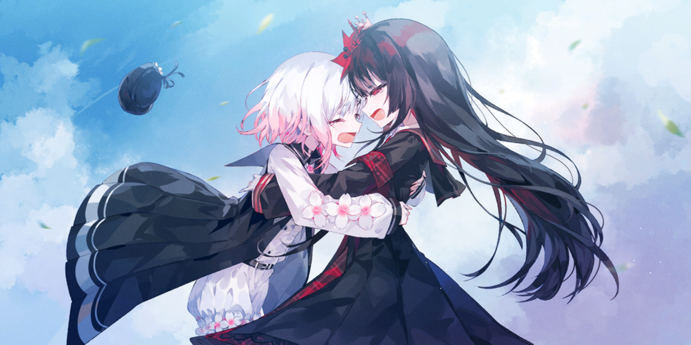
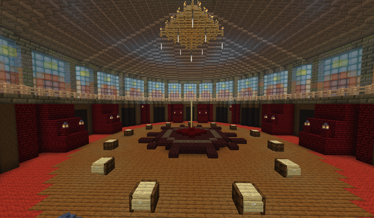

# 魔法少女的魔女审判：Minecraft 剧情推理服务器

本项目基于游戏《魔法少女的魔女审判》（参见配图一），改编而来的 Minecraft 主题剧情推理服务器。玩法类似于狼人杀，结合原作设定和全新自创内容与剧情玩法，打造独特的推理体验。服务器采用消息核心地图和事件系统，并围绕《魔法少女的魔女审判》展开，包括丰富的角色扮演与推理机制，是二次元剧情粉和推理爱好者的理想乐园。

## 游戏配图

  
   
  <small>配图一：原作《魔法少女的魔女审判》游戏画面</small>
    
  
   
  <small>配图二：本服务器核心地图截图及玩法预览</small>

## 游戏特色

- **独特世界观设定**：以《魔法少女的魔女审判》为背景，融合 Minecraft 自由开放的世界，带来沉浸式游戏体验。
- **剧情驱动推理玩法**：每局游戏展开多线叙事，多重事件线索交错，考验大家的逻辑推理与角色代入。
- **角色扮演系统**：玩家可扮演魔法少女、魔女、审判官等多种角色，每个角色拥有独特技能与职责，塑造专属故事和胜利路径。
- **消息核心地图**：核心地图将原作场景与 Minecraft 功能结合，自动推送事件、线索和动态改变环境，营造紧张氛围。
- **创新自创剧情**：基于原作增加全新角色、设定及剧情，赋予每局游戏不同发展和结局，保证每次体验都独一无二。
- **多样互动与共犯机制**：支持多人协作与背叛，玩家之间可发展复杂关系网，共犯机制让推理更加烧脑。

## 开发团队

开发者与共犯团队成员（排名不分先后）：
- xxx
- xxx
- xxx
- xxx
- xxx

感谢所有贡献者与玩家的热情参与和创意支持！

## 服务器状态说明

本服务器持续维护与优化，欢迎加入体验和反馈！

- 当前状态： 堆
- 最新消息与更新请关注 [游戏官方网站]() 或 [仓库 Issue & Discussions]() 
- 服务器支持最新版 Minecraft 客户端和跨平台游玩

## 如何加入

1. 安装 Minecraft 最新客户端
2. 下载或获取服务器地址
3. 加入服务器后，按照游戏指引体验剧情推理玩法

## 资源与配图

- 配图一：原作《魔法少女的魔女审判》游戏画面  
- 配图二：本服务器核心地图截图及玩法预览

## 贡献方式

欢迎游戏开发、剧情策划、代码优化等领域爱好者加入开发 ——  
提交 Issue、Pull Request 或参与讨论，共同打造更完善的剧情推理乐园！

---

如有疑问或建议，欢迎在 Issue 区留言，谢谢支持！
